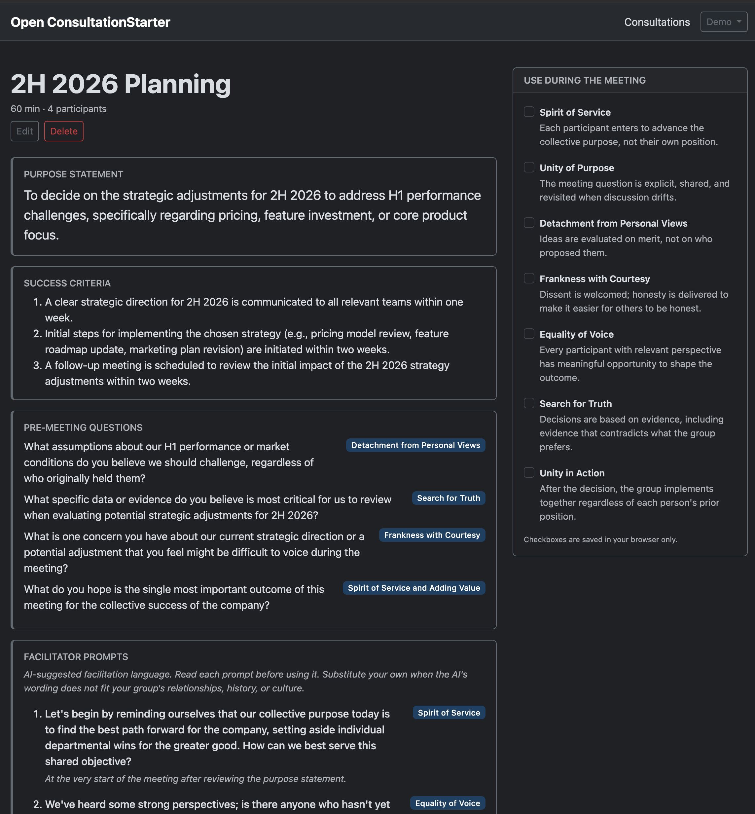

# ConsultationStarter Demo

> Describe the decision. Get a meeting plan that produces a real conversation.

ConsultationStarter Demo turns a one-paragraph description of a decision into a complete meeting plan structured around the Seven Principles of Consultation. Enter your topic, what you are deciding, your participants, and the duration; receive a sharpened purpose statement, three success criteria, anonymous pre-meeting questions, in-session facilitator prompts mapped to the principles, and a decision record template ready to copy into your note-taker.



## Why I built this

I am building ConsultationStarter, a multi-tenant SaaS that gives recurring decision-making bodies — executive teams, boards, committees, councils, faith-community bodies, cooperative circles — a meeting practice grounded in the Seven Principles. The full product has team collaboration, async pre-meeting input, in-session principle checks, longitudinal scorecards across a year of meetings, and a follow-through tracker. This demo strips all of that out and isolates the meeting-plan engine: the moment where a vague topic becomes a structure a group can actually consult inside of.

It is open source under the MIT license because the framework is too valuable to lock behind a single product. If you clone it and use it once a month for the next year, that is a win. If you fork it and extend it for your own context, that is a bigger win.

## Setup

```bash
git clone <repo>
cd open-consultationstarter
cp .env.example .env
# Add your GEMINI_API_KEY to .env
bin/setup
rails db:seed
bin/dev
```

Sign in at `http://localhost:3000/sign_in` with `demo@example.com` / `password123`.

No app-specific setup beyond the boilerplate's `bin/setup` is required. There is no separate service, no Redis, no background job runner. You need a `GEMINI_API_KEY` from [Google AI Studio](https://aistudio.google.com/app/apikey) and you are ready to run.

## Editing the AI prompt

The AI template (`consultationstarter_meeting_plan_v1`) is editable in the admin panel at `/admin/ai_templates`. Sign in as the seeded admin, navigate to the template, and use the live test panel on the right to iterate on prompt changes before saving.

## A note on sensitive data

Do not paste real names, real personnel issues, or real legal matters into this local demo. The decision paragraph and context fields are likely places where users would paste sensitive details. This is a localhost-only demo with no production data handling — treat it accordingly.

## Environment Variables

| Variable | Default | Description |
|---|---|---|
| `APP_NAME` | `"Open Demo Starter"` | Displayed in the navbar and title |
| `APP_TAGLINE` | — | Shown in the footer and landing page |
| `APP_DESCRIPTION` | — | Shown on the landing page |
| `GEMINI_API_KEY` | (required) | Your Google Gemini API key |
| `AI_CALLS_PER_USER_PER_DAY` | `50` | Daily AI call budget per user |
| `AI_GLOBAL_TIMEOUT_SECONDS` | `30` | Gemini request timeout in seconds (complex prompts can take 15–25s) |

## Stack

| Layer | Choice |
|---|---|
| Framework | Rails 8.1 |
| Database | PostgreSQL with UUID primary keys |
| Auth | Rails native (`has_secure_password`, sessions) |
| CSS | Bootstrap 5 dark mode (CDN) |
| JavaScript | Stimulus + Turbo via importmap |
| AI | Google Gemini via `gemini-ai` gem |
| Queue / Cache / Cable | Solid Stack (no Redis) |
| Testing | RSpec |

## AI Safety Posture

**What this boilerplate enforces:**
- Per-user daily call cap (default: 50/day, set via `AI_CALLS_PER_USER_PER_DAY`)
- Pre-flight gatekeeper: input length limit, prompt injection patterns, profanity filter
- Hard output token cap per template
- Configurable request timeout (default: 15s)
- Full request log with status, tokens, duration, and cost estimate
- Fail-soft UI: errors render an inline alert, never crash the page
- AI disclaimer in the footer on every page

**Deliberately omitted (with rationale):**
- No PII scrubbing — demo apps have no production user data
- No content moderation API — Gemini's built-in safety filters are sufficient
- No automatic retries — avoids stacking costs on transient failures
- No RAG or vector DB — single-shot prompts only
- No streaming — synchronous calls keep the code simple

See `app/services/ai_gatekeeper.rb` and `app/services/ai_budget_checker.rb` to extend.

## Cost

All templates use `gemini-2.5-flash`, which has a generous free tier. A user running the demo locally will not incur charges under typical use.

## License

MIT — see [LICENSE](LICENSE)
